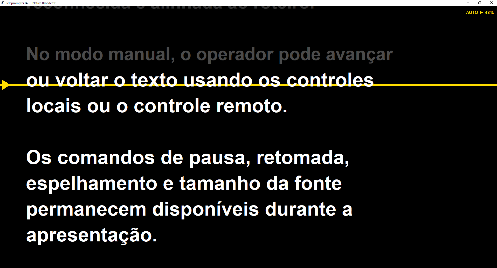
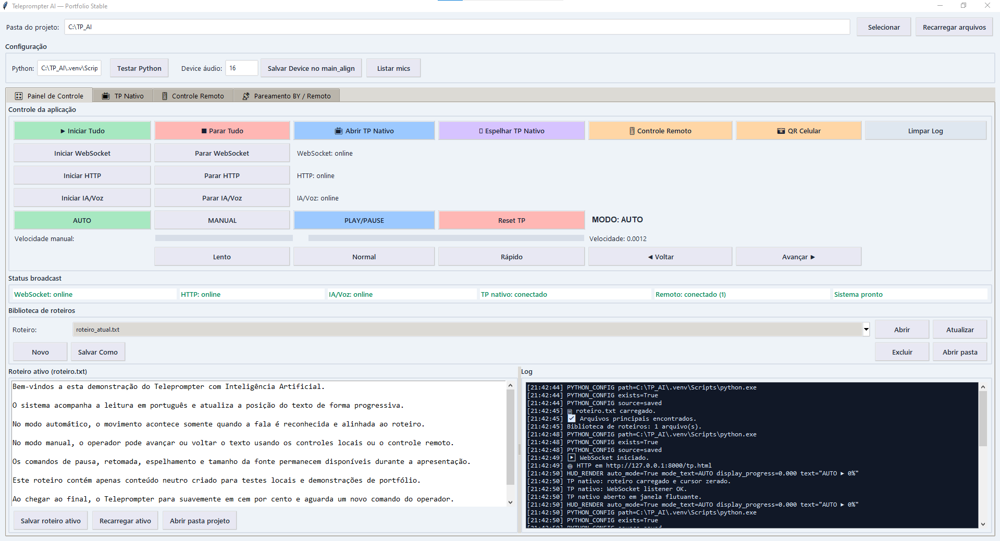
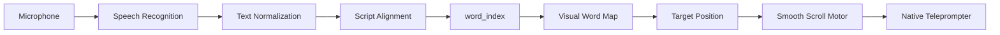

# Teleprompter AI — Speech-Synchronized Broadcast Teleprompter

A functional portfolio prototype for broadcast workflows, combining speech recognition, script alignment, and smooth teleprompter scrolling.

[English](#english) | [Português](#portugues)




*Native Broadcast Teleprompter — speech-synchronized scrolling with AUTO/MANUAL operation.*

<a id="english"></a>

## Overview

Teleprompter AI is a functional application and portfolio prototype designed for broadcast workflows. It follows the presenter's speech, aligns recognized text with the loaded script, and converts the resulting textual position into a visual scrolling position. The operator can switch between speech-driven automation and direct manual control during a session.

## Key Features

- Speech-synchronized automatic scrolling
- AUTO / MANUAL operation
- Native broadcast teleprompter window
- Remote control from phone or tablet
- QR-based remote pairing
- WebSocket communication
- PLAY / PAUSE / RESET controls
- Manual shuttle forward and back
- Horizontal mirror mode
- Font size control
- Session-aware RESET
- Visual progress HUD
- Local script library
- Smooth scroll motor

## Demo

### Operator Interface



### Native Teleprompter


### Mobile Remote Control


## How It Works



The current implementation uses **faster-whisper**, **RapidFuzz**, **Tkinter**, **WebSockets**, **sounddevice**, **NumPy**, and **Pillow**. See the [technical architecture](docs/ARCHITECTURE.md) for the detailed data flow and operational state model.

## Quick Start

Requirements: Windows, Python 3.11, and a working microphone. Audio device indices vary by machine; select the appropriate input device for the local system.

```powershell
git clone https://github.com/abelalves962-oss/teleprompter-ai.git
cd teleprompter-ai

py -3.11 -m venv .venv
.\.venv\Scripts\Activate.ps1
python -m pip install -r requirements.txt
python TP_Control_GUI.py
```

The first use of the speech model may require downloading its model files.

## Tests

The validated project state has **62 automated tests passing**. Run the current suite with:

```powershell
.\.venv\Scripts\python.exe -m unittest discover -s tests -v
```

No test coverage percentage is claimed. See the [local testing guide](docs/TESTING.md) for hardware-independent and manual validation scenarios.

## Project Structure

```text
teleprompter-ai/
├── TP_Control_GUI.py
├── main_align_ws.py
├── scroll_server.py
├── tp.html
├── remote.html
├── requirements.txt
├── tests/
├── docs/
├── examples/
└── roteiros/
```

- `TP_Control_GUI.py` — Tkinter operator interface, process management, local script library, controls, and native teleprompter rendering.
- `main_align_ws.py` — audio capture, speech transcription, text normalization, script alignment, and progress updates.
- `scroll_server.py` — WebSocket relay for commands and state updates.
- `tp.html` and `remote.html` — browser-based teleprompter and remote-control interfaces.
- `tests/` — automated contract tests; `docs/` — architecture, testing notes, and real screenshots.

## Security and Network

- Local HTTP and WebSocket servers bind to loopback by default.
- LAN access is enabled only when needed for mobile remote control and should be used on a trusted network.
- The pairing QR code uses a dynamically detected LAN IPv4 address; no fixed or real-world IP is published here.
- A temporary PIN is used for remote pairing.
- Local configuration, runtime state, virtual environments, logs, and the generated PIN-bearing remote page are ignored by Git.

## Roadmap

The following are future improvements, not current capabilities:

- Integration with editorial workflows such as iNews/Autoscript
- Application packaging and distribution
- Operational telemetry
- Operator profiles and configuration presets
- Additional validation in broadcast environments

## Disclaimer

This repository presents a functional portfolio prototype focused on broadcast engineering and AI-assisted teleprompter workflows. It does not represent a claim of deployment in any broadcaster's production environment.

<a id="portugues"></a>

# Português

## Visão geral

O Teleprompter AI é uma aplicação funcional e um protótipo de portfólio voltado a fluxos de broadcast. O sistema acompanha a fala do apresentador, alinha o texto reconhecido ao roteiro carregado e transforma a posição textual em uma posição visual de rolagem.

## Principais recursos

- Rolagem automática sincronizada com a fala
- Operação AUTO / MANUAL e controles PLAY / PAUSE / RESET
- Janela de teleprompter nativo com HUD de progresso
- Controle remoto por celular ou tablet, pareamento por QR e PIN
- Comunicação WebSocket
- Shuttle manual para avançar e voltar
- Espelhamento horizontal e ajuste de fonte
- RESET protegido por sessão, biblioteca local de roteiros e rolagem suave

## Como funciona

O microfone alimenta o reconhecimento de fala; o texto é normalizado e alinhado ao roteiro. O `word_index` resultante é convertido pelo mapa visual em uma posição-alvo, seguida pelo motor de rolagem suave do teleprompter nativo. Consulte o [diagrama e a arquitetura técnica](docs/ARCHITECTURE.md).

## Execução rápida

Requisitos: Windows, Python 3.11 e microfone funcional. O índice do dispositivo de áudio depende de cada máquina.

```powershell
git clone https://github.com/abelalves962-oss/teleprompter-ai.git
cd teleprompter-ai
py -3.11 -m venv .venv
.\.venv\Scripts\Activate.ps1
python -m pip install -r requirements.txt
python TP_Control_GUI.py
```

## Testes

O estado validado possui **62 testes automatizados aprovados**:

```powershell
.\.venv\Scripts\python.exe -m unittest discover -s tests -v
```

Veja também o [guia de testes locais](docs/TESTING.md). Não é informado percentual de cobertura.

## Demonstração

As capturas reais mostram a [interface do operador](docs/images/interface.png), o [teleprompter nativo](docs/images/teleprompter.png) e o [controle remoto móvel](docs/images/remote.png).

## Segurança e rede

Os servidores locais usam loopback por padrão. O acesso LAN é habilitado quando necessário para o controle remoto; o QR usa o IPv4 da LAN detectado dinamicamente e o pareamento utiliza PIN. Configurações locais, estados de execução e outros arquivos de runtime são ignorados pelo Git. Não há IP real publicado neste README.

## Melhorias futuras

Integração com workflows editoriais como iNews/Autoscript, empacotamento e distribuição, telemetria operacional, perfis/configurações de operador e validações adicionais em ambientes de broadcast permanecem exclusivamente no roadmap.

## Aviso

Este repositório apresenta um protótipo funcional de portfólio focado em engenharia de broadcast e fluxos de teleprompter assistidos por IA. Ele não representa uma alegação de implantação em ambiente de produção de qualquer emissora.

## License

No license has been selected yet.

## Author

Paulo Abel Pereira Alves

Telecommunications Engineering | Broadcast Engineering | Python | AI
