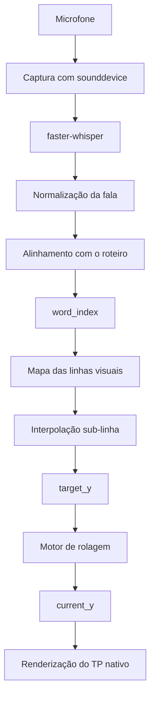

# Arquitetura técnica

## Fluxo de dados

O sistema mantém separadas a interpretação da fala, a definição do destino visual e a posição física exibida. Essa separação permite que mensagens de reconhecimento atualizem um alvo sem deslocar diretamente o texto.

## Reconhecimento e alinhamento

`main_align_ws.py` captura o áudio do microfone, executa a transcrição e normaliza a fala para comparação com o roteiro. O alinhamento produz progresso e `word_index`, enviados pela conexão WebSocket persistente.

## Mapa visual e alvo

`TP_Control_GUI.py` quebra o roteiro conforme largura e fonte reais. Cada linha renderizada recebe uma faixa inclusiva de índices de palavras. O `word_index` identifica a linha e sua posição relativa dentro dela; essa fração gera um `target_y` sub-linha monotônico.

O alvo não altera `current_y` diretamente. O motor existente aproxima a posição física do destino usando velocidade, aceleração, damping e `dt`. A renderização utiliza `current_y`, e o percentual do HUD representa essa posição visual.

## Comunicação

`scroll_server.py` mantém o servidor WebSocket e distribui mensagens entre os participantes. A interface também oferece HTTP para as páginas do teleprompter e do controle remoto. Os serviços usam loopback por padrão; exposição em LAN é uma configuração explícita.

## Estados operacionais

### AUTO e MANUAL

- **AUTO:** `target_y` vem do `word_index`, do mapa visual e da interpolação sub-linha.
- **MANUAL:** Avançar/Voltar definem alvos por linha.

Os dois modos preservam o mesmo motor físico. A troca de modo altera a fonte do alvo, não a dinâmica da rolagem.

### PLAY e PAUSE

PLAY/PAUSE é independente de AUTO/MANUAL. PAUSE congela a evolução física sem descartar o destino pendente; PLAY permite que o motor retome a perseguição do alvo.

### session_id

Cada sessão de leitura possui um identificador. Mensagens com `session_id` diferente da sessão ativa são descartadas, protegendo a leitura contra pacotes atrasados de uma execução anterior.

### RESET

RESET inicia uma nova sessão, recarrega o roteiro e restaura posição, destino, progresso, índice de palavra e estado de finalização. As primeiras palavras da nova sessão voltam a produzir alvos sub-linha a partir do início visual.

## Componentes atuais

| Componente | Responsabilidade |
| --- | --- |
| `TP_Control_GUI.py` | Interface, processos, controles, biblioteca e TP nativo |
| `main_align_ws.py` | Áudio, Whisper, normalização e alinhamento |
| `scroll_server.py` | Relay WebSocket e estado de conexão |
| `remote_by.html` | Controle remoto gerado com PIN temporário |

Esta documentação descreve a implementação atual, ainda concentrada em poucos componentes principais. Modularização adicional está planejada, mas não é apresentada como recurso já concluído.
